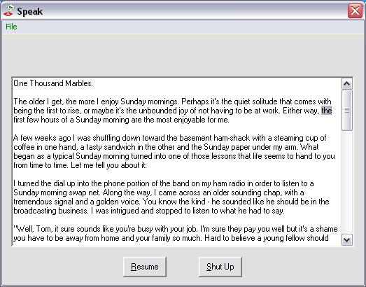



## Text To Speech

### Description

This little gadget shows how to use the MS Speech Object Library. You drop or open a textfile and it will read it to you (english language; other languages work but will be pronounced rather american-ly).
 
### More Info
 
Textfile

Noise

             |
---                |---
**Submitted On**   |2006-04-08 18:21:20
**By**             |[ULLI](https://github.com/Planet-Source-Code/PSCIndex/blob/master/ByAuthor/ulli.md)
**Level**          |Intermediate
**User Rating**    |5.0 (30 globes from 6 users)
**Compatibility**  |VB 6\.0
**Category**       |[Sound/MP3](https://github.com/Planet-Source-Code/PSCIndex/blob/master/ByCategory/sound-mp3__1-45.md)
**World**          |[Visual Basic](https://github.com/Planet-Source-Code/PSCIndex/blob/master/ByWorld/visual-basic.md)
**Archive File**   |[Text\_To\_Sp2042521142007\.zip](https://github.com/Planet-Source-Code/ulli-text-to-speech__1-67623/archive/master.zip)

